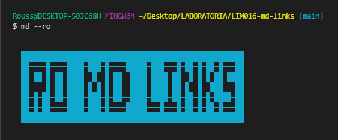
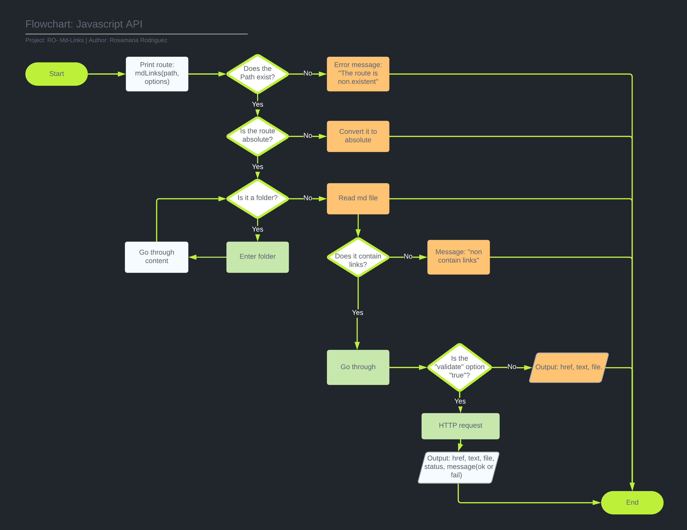
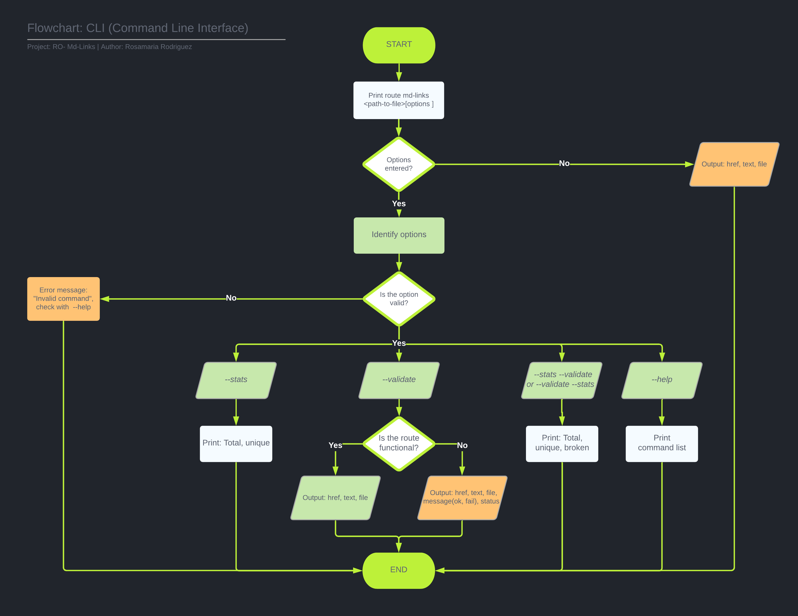
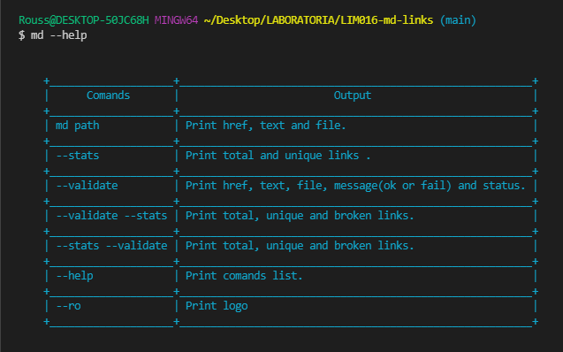
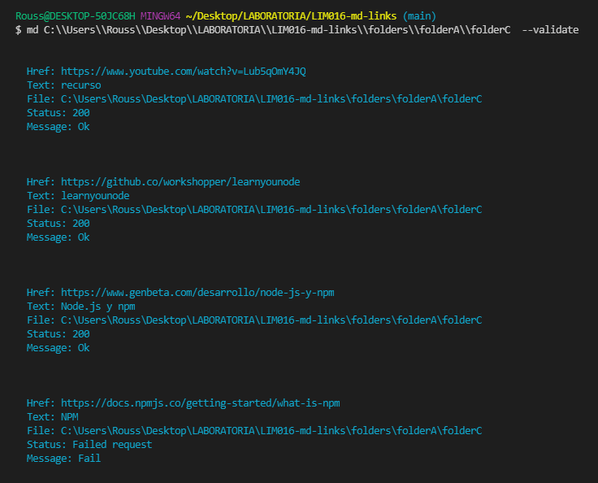
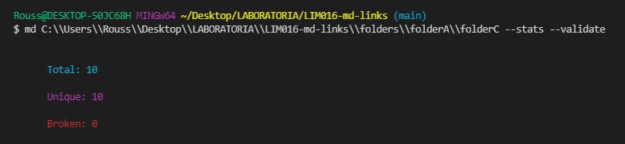
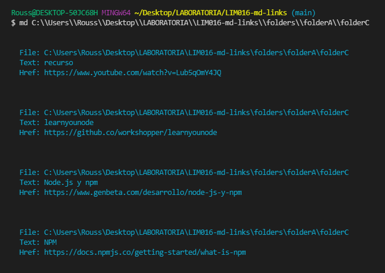
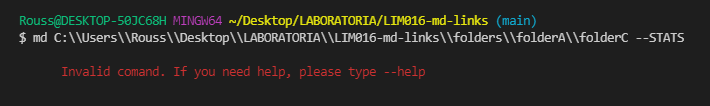
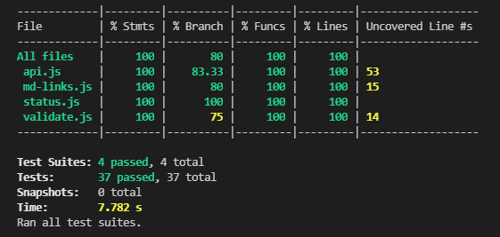

## ÍNDICE
* [1. Ro md Links 📁](#1-Ro-md-Links)
* [2. Instalación](#-2-Instalación)
* [3. Realización del Proyecto](#2-Realización-del-Proyecto)
* [4. Resultados de los tests](#3-Resultados-de-los-tests)
* [5. Tecnologías empleadas](#4-tecnologias-empleadas)
* [6. Fuentes](#5-fuentes)
* [7. Autores](#6-autores)

***

<div align="center">

</div>

# 1. Ro md Links

 👩🏽‍💻 **RO-MD-LINKS** : Librería desarrollada de línea de comando (CLI) con Node. js,  que lee y analiza archivos 📁 en formato Markdown 📑 dada una ruta, para verificar los links que contengan ,y así reportar algunas estadísticas.📊

***

# 2. Instalación
Para instalar la librería Ro md link, se necesitará escribir el siguiente comando en la terminal.

``` js
npm i ro-md-links
```

# 3. Realización del Proyecto
## Este proyecto consta de DOS partes
## 3.1 Diagramas de Flujo ✍🏼

### A) JavaScript API

<div align="center">

</div>

### B) CLI (Command Line Interface - Interfaz de Línea de Comando)

<div align="center">

</div>

## 3.2 Descripción del proceso ✍🏼
### A) JavaScript API

El módulo debe poder **importarse** en otros scripts de Node.js y debe ofrecer la
siguiente interfaz:

## 📌 `mdLinks(path, options)`

### Argumentos

* `path`: Ruta **absoluta** o **relativa** al **archivo** o **directorio**.
Si la ruta pasada es relativa, debe resolverse como relativa al directorio
desde donde se invoca node - _current working directory_).
* `options`: Un objeto con **únicamente** la siguiente propiedad:
  - `validate`: Booleano que determina si se desea validar los links
    encontrados.

### Valor de retorno

La función debe **retornar una promesa** (`Promise`) que **resuelva a un arreglo**
(`Array`) de objetos (`Object`), donde cada objeto representa un link y contiene
las siguientes propiedades

Con `validate:false` :

* `href`: URL encontrada.
* `text`: Texto que aparecía dentro del link (`<a>`).
* `file`: Ruta del archivo donde se encontró el link.

Con `validate:true` :

* `href`: URL encontrada.
* `text`: Texto que aparecía dentro del link (`<a>`).
* `file`: Ruta del archivo donde se encontró el link.
* `status`: Código de respuesta HTTP.
* `ok`: Mensaje `fail` en caso de fallo u `ok` en caso de éxito.

## Función md links empleada:

```js
const styleBroken = chalk.bold.red;

export const mdLinksFunction = (track, options = { validate: true }) => new Promise((resolve) => {
  // convert path in absolute
  const path = convertToAbsolute(track);
  // if path does not exits
  if (isExistsPath(path) === false) {
  // message if does not exist
  styleBroken('Path does not exist')
    // if options validate is true
  } else if (options.validate) {
    const validate = getvalidLinksInArray(getLinksInArray(path));
    resolve(validate);
    // if options validate is false
  } else {
    resolve(getLinksInArray(path));
  }
});
```

### B) CLI (Command Line Interface - Interfaz de Línea de Comando)

El ejecutable de nuestra aplicación debe poder ejecutarse de la siguiente
manera a través de la **terminal**:

`md <path-to-file> [options]`

El comportamiento por defecto no debe validar si las URLs responden ok o no,
solo debe identificar el archivo markdown (a partir de la ruta que recibe como
argumento), analizar el archivo Markdown e imprimir los links que vaya
encontrando, junto con la ruta del archivo donde aparece y el texto
que hay dentro del link (truncado a 50 caracteres).

#### Options

## 📌 `--help`

<div align="center">

</div>

## 📌 `--validate`

Si pasamos la opción `--validate`, el módulo debe hacer una petición HTTP para
averiguar si el link funciona o no. Si el link resulta en una redirección a una
URL que responde ok, entonces consideraremos el link como ok.

<div align="center">

</div>

Vemos que el _output_ en este caso incluye la palabra `ok` o `fail` después de
la URL, así como el status de la respuesta recibida a la petición HTTP a dicha
URL.

## 📌 `--stats`

Si pasamos la opción `--stats` el output (salida) será un texto con estadísticas
básicas sobre los links.

<div align="center">

</div>

## 📌 `--stats --validate` o `--validate --stats`

También podemos combinar `--stats` y `--validate` para obtener estadísticas que
necesiten de los resultados de la validación.

<div align="center">

</div>

## 📌 `--ro`

<div align="center">

</div>

## 📌 `Colocando solo el path`

<div align="center">

</div>

## 📌 `Colocando contenido inválido`

<div align="center">

</div>

***
# 4. Resultados de los tests

<div align="center">

</div>

# 5. Tecnologías empleadas 👩🏾‍💻

## Para la Planificación ✍

-   [Github Projects:](https://developer.mozilla.org/es/docs/Web/HTML) En este proyecto se utilizó la herramienta de planificación y organización de GitHub llamada **Github Projects**.Mediante **issues** y **milestones** podrás organizar y planificar tareas y objetivos concretos.

Tomando en consideración los **entregables** del proyecto, se definió historias de usuario en base a 
`diagramas de flujos`, para crear la planificación.
## Para la estructura y diseño: ✍
-   [Chalk:](https://www.npmjs.com/package/chalk)  Es una librería que ayuda a darle formato de estilo en el terminal.

-   [Generadores de Texto:](https://unicode-table.com/es/tools/text-to-symbols/)  Usada para definir el logo en la terminal para mi librería

## Para el Testing: ✍
-   [Jest:](https://jestjs.io/docs/es-ES/getting-started)  Framework para realizar los testing unitarios.

-   [Eslint:](https://jestjs.io/docs/es-ES/getting-started)  Herramienta de linting para analizar el código en busca de errores.

## Para la funcionalidad: ✍
-   [Javascript:](https://developer.mozilla.org/es/docs/Web/JavaScript)  Para dar la funcionalidad a la plataforma.

-   [Node.js:](https://nodejs.org/es/)  es un entorno de ejecución para JavaScript construido con el [motor de JavaScript V8 de Chrome](https://developers.google.com/v8/). Esto nos va a permitir ejecutar JavaScript en el entorno del sistema operativo, ya sea tu máquina o un servidor, lo cual nos abre las puertas para poder interactuar con el sistema en sí, archivos, redes, ...

-   [Node-fetch:](https://www.npmjs.com/package/node-fetch)  En lugar de implementar XMLHttpRequesten Node.js para ejecutar Fetch polyfill específico del navegador , ¿por qué no pasar directamente de nativo httpa fetchAPI? Por lo tanto, node-fetchcódigo mínimo para una window.fetchAPI compatible en tiempo de ejecución de Node.js.
Vea el isomorphic-unfetch de Jason Miller o el cross-fetch de Leonardo Quixada para el uso isomorfo (exportaciones node-fetchpara el lado del servidor, whatwg-fetchpara el lado del cliente).

-   [Markdown](https://es.wikipedia.org/wiki/Markdown) es un lenguaje de marcado ligero muy popular entre developers. Es usado en muchísimas plataformas que manejan texto plano (GitHub, foros, blogs, ...), y es muy común encontrar varios archivos en ese formato en cualquier tipo de repositorio (empezando por el tradicional `README.md`).

***
# 6. Fuentes 📚
- [Repositorio de Laboratoria:](https://github.com/Laboratoria/LIM016-md-links) Se encuentran todas las condiciones y herramientas a trabajar para el proyecto.

# 7. Autores 📍
- [Rosamaria Rodriguez](https://github.com/RJRCH123)
- Equipo de Laboratoria LIM016

****

